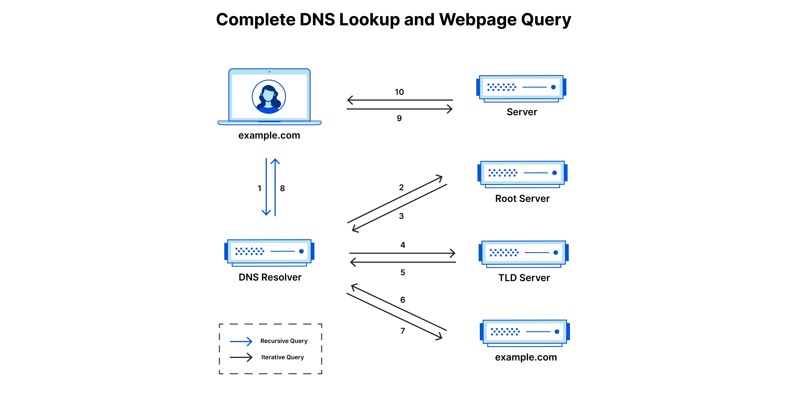

# How the Web Works: A Guide to the Inner Workings of the Internet

Have you ever wondered how the web seems to just “know” what you’re looking for when you type something into a search engine or click on a link? Behind every website you visit, there’s a complex system of communication between your device and powerful servers that make it all happen. In this article, we’ll break down the essential components of how the web works, from how browsers and servers communicate to the technical details of services like e-commerce and social media.

---

## How the Web Works: The Basics of Communication

Before diving into protocols and services, let’s first understand the main components involved in the web.

### Clients, Servers, and Communication

At the heart of the web’s functionality is the communication between two key components: the client (your device) and the server (the machine that stores all the content). When you type a website’s URL into your browser, the client sends a request to the server asking for the page. The server, in turn, sends the requested content back to the client, where it’s displayed for you to view. It’s a bit like a waiter (the server) taking your order (the request) and bringing you your meal (the response).

This communication follows a set of rules called **protocols**, which ensure that data is transferred properly. The most commonly used protocol on the web is **HTTP** (Hypertext Transfer Protocol). But there’s a more secure version of HTTP called **HTTPS**, which ensures your data is encrypted and protected. Let’s dive deeper into this in the next section.

---

## Web Protocols: How the Web Speaks

Now that we know the players, let’s take a closer look at the protocols that make it all work, such as HTTP, TCP/IP, HTML, and DNS.

### HTTP/HTTPS: How Requests and Responses Work

When you enter a website’s address in your browser, your device sends an HTTP request to the server asking for the page. The server responds with the necessary files (usually HTML) to display the page. This process is known as a **request-response cycle**.

However, HTTP by itself doesn’t encrypt the data being sent, which can leave it vulnerable to hackers. That’s where HTTPS comes in. **HTTPS** (Hypertext Transfer Protocol Secure) adds an extra layer of security by encrypting the communication between your browser and the server. It uses **SSL/TLS** encryption to protect sensitive information, such as passwords and credit card details. So, whenever you shop online or log into a secure account, you’re doing it over HTTPS for added protection.

### TCP/IP

**Transmission Control Protocol** (TCP) and **Internet Protocol** (IP) are the fundamental communication protocols used for sending and receiving data on the internet. They ensure that data travels from one device to another reliably, much like the transport mechanisms—cars or bikes—that allow goods to move across the road.

### HTML: The Structure of Web Content

So, what’s behind all the text, images, and links you see on web pages? That’s where **HTML** (Hypertext Markup Language) comes in. HTML is the standard language used to create web pages. It defines the structure and layout of the page, telling the browser where to place headings, paragraphs, images, and links.

HTML uses “tags” like `<h1>`, `
`, and `` to organize content. These tags help the browser know how to display the content. For example, the `<h1>` tag indicates a top-level heading, while the `
` tag marks a paragraph. It’s like a blueprint for the page, guiding the browser on how to structure the content.

**HTML5**, the latest version, introduced new features such as native video and audio support, making it easier for web developers to create rich media experiences.

### DNS: Mapping Domain Names to IP Addresses

When you type a website address like "www.example.com" into your browser, your device needs to figure out where to send the request. That’s where the **Domain Name System** (DNS) comes in. DNS is like the phone book of the internet—it translates human-readable domain names into machine-readable IP addresses.

Without DNS, we’d have to memorize long strings of numbers instead of simple, memorable domain names. DNS ensures that when you type a website’s address, you’re directed to the correct server without needing to know its IP address. It’s what makes browsing the web user-friendly.

---

## Implementation of Popular Services: How the Web Powers E-Commerce, Social Media, and More

Now let’s take a look at how popular web services, like e-commerce, social media, and streaming, rely on complex backend systems to function smoothly. These services use a mix of servers, databases, and APIs to offer seamless experiences for users.

### E-Commerce: Shopping Cart Management, Payment Gateways, and Server-Side Logic

Online shopping has become a massive part of our daily lives, and behind every purchase is a well-organized system of servers working in the background.

- **Shopping Cart Management**: When you add an item to your cart, the server keeps track of it. It ensures the item stays in your cart until you're ready to check out, and it also updates availability in real-time, so you don’t end up buying something that’s out of stock. The server makes sure your cart is always up-to-date with the correct prices and stock levels.
- **Payment Gateways**: Once you’re ready to pay, payment gateways take over. These systems securely transmit your payment details to the payment processor and handle the transaction. After the payment is confirmed, the server updates the stock levels, triggers order fulfillment, and sends confirmation notifications. Payment gateways use encryption to protect sensitive data, ensuring both customer and merchant information remains secure.

### Social Media: User Interactions, Data Storage, and APIs

Social media platforms like **Facebook**, **Instagram**, and **Twitter** rely on massive backend systems to handle the constant flow of user-generated content. Whether you're posting a photo, liking a status, or leaving a comment, your interactions are captured and stored by the servers.

- **User Interactions**: Every time you interact with content on a social media platform, the server processes and stores your actions. This includes posts, likes, comments, and media uploads, which are all indexed and stored in large, distributed databases for easy retrieval.
- **APIs**: **APIs** (Application Programming Interfaces) play a key role in connecting social media platforms with other services. For example, Twitter’s API allows websites to embed tweets, and many services use APIs to share content or data across platforms. APIs help enable seamless data exchange, making the digital world more interconnected.

### Streaming: Content Delivery Networks (CDNs) and Buffering Mechanisms

Streaming platforms like **Netflix** and **YouTube** make it easy to consume media online, but have you ever wondered how they manage to deliver video content smoothly to millions of users at once?

- **Content Delivery Networks (CDNs)**: CDNs are distributed networks of servers that store copies of content (like videos) in multiple locations around the world. By storing content closer to the user, CDNs reduce loading times and ensure faster delivery, no matter where you are.
- **Buffering**: Buffering is a technique used by streaming services to prevent interruptions in playback. Before a video starts playing, a portion of the video is preloaded onto your device, ensuring a smooth experience even if your internet connection fluctuates. It’s like a quick pause to make sure everything runs smoothly!

---

## Conclusion: The Web Uncovered

Understanding how the web works can make it feel a bit less mysterious. At its core, it’s all about communication—clients sending requests to servers, protocols ensuring data is transferred properly, and backend systems powering services like e-commerce and social media. Next time you’re shopping online or watching a video, you’ll have a better understanding of what’s happening behind the scenes!
